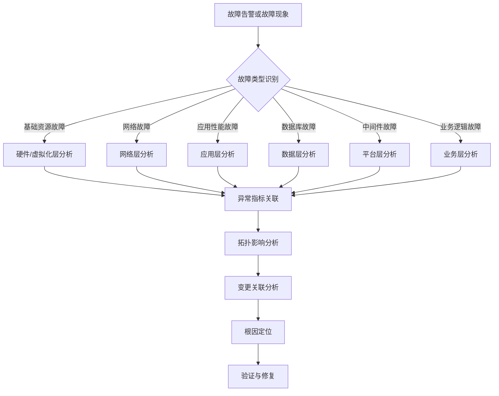

# Alarm Analyst

该技能用于处理“用户从 Portal 的告警入口进入，希望围绕一条具体活动告警完成根因分析与处置闭环”的场景。

它不是单纯的告警查询技能，也不是只输出一句诊断结论的模板技能。它的目标是：

1. 把 Portal 里的单条活动告警接入故障处置会话
2. 围绕该告警组织用户可见的分析过程
3. 在接口尚未全部接线时，也让用户清楚看到系统将如何完成闭环

---

## 一、面向当前方案的定位

当前业务方案是：

1. AI 查询智观的活动告警接口
2. AI 通知智观生成工单，并开始处置告警
3. AI 完成处置后，通知智观清除告警并修改工单状态

Portal 落地时，需要体现以下链路：

1. Portal 调用智观告警接口，查询最近 7 日活动告警，在右上角铃铛展示
2. 用户点击某条告警后，把这条告警发送给故障处置员数字员工
3. 故障处置员对该告警进行根因分析：
   - 查询 CMDB 资源信息
   - 查询指标
   - AI 判断异常指标
   - 分析影响范围
   - 给出处置建议
4. AI 可闭环时：
   - 执行处置
   - 检测是否恢复正常
   - 通知智观清除告警
   - 通知智观修改工单状态
5. AI 不可闭环时：
   - 派发故障工单
   - 等待恢复告警或人工处理完成
   - 再检测是否恢复正常

本 skill 就是为这条主链路服务的。

---

## 二、何时使用

当用户请求满足以下特征时，优先使用本技能：

- 用户给出了一条具体告警，或当前上下文中已经选中一条活动告警
- 用户希望继续分析故障，而不是只看告警列表
- 用户希望看到完整分析过程、影响范围和处置建议
- 用户需要围绕这条告警推进“工单 / 恢复验证 / 清除告警 / 更新状态”的闭环
- 告警与数据库、MySQL、锁异常、死锁、性能异常、服务异常等主题相关

典型示例：

- `分析这条数据库锁异常告警`
- `从这个告警继续定位故障原因`
- `数据库锁异常（db_mysql_001 10.43.150.186），帮我分析一下`
- `基于这条告警给出处置建议`
- `继续把这条告警闭环`
- `某应用新增数据失败，帮我分析一下`
- `CMDB 插入数据失败，帮我定位原因`

---

## 三、何时不要使用

以下场景不要使用本技能：

- 用户只是想看最近有哪些活动告警、告警数量、告警分布 -> 用 `real-alarm`
- 用户已经具备完整工单上下文，要继续工单闭环 -> 用 `fault-disposal`
- 用户要做固定场景码的场景级 RCA 编排 -> 用 `scenario-root-cause-analyst`

简化判断：

- “看告警列表” -> `real-alarm`
- “基于单条告警做分析与闭环” -> `alarm-analyst`
- “基于工单继续处置” -> `fault-disposal`

---

## 四、执行优先级

本 skill 不是纯展示模板。**只要当前工作区已经具备可用工具，就必须优先执行真实动作，再组织说明。**

优先级如下：

1. 先实际调用可用能力：
   - 使用 `list_agents` / `chat_with_agent` / `multi_agent_collaboration` 协作 query 数字员工查询 CMDB
   - 使用 `execute_shell_command` 执行 `scripts/get_metric_definitions.py`
2. 再把执行结果整理成面向用户的阶段化输出
3. 只有当真实调用失败时，才允许退回“计划 + mock + 失败原因”模式

如果已经满足执行条件，就不要只回复：

- `计划调用`
- `下一步执行`
- `需要继续吗`
- `请告诉我是否继续`

必须先做真实调用，再汇报结果。

### 什么时候允许只展示计划

只有以下情况才允许只展示计划而不执行：

1. 当前工具里没有 `execute_shell_command`
2. 当前工具里没有 `list_agents` / `chat_with_agent` / `multi_agent_collaboration`
3. 缺少执行所需关键参数，且无法从当前上下文推断
4. 用户明确要求“先不要执行，只给方案”

除此之外，默认都应直接执行。

### 最短执行路径

对于 `数据库锁异常（db_mysql_001 10.43.150.186）` 这类 MySQL 告警，默认最短路径是：

1. 从告警文本中提取资产编号、IP、告警标题
2. 通过 query 数字员工的 `veops-cmdb` 查询 CMDB，获取：
   - `ciType`
   - `CI ID`
   - 应用/环境/拓扑
3. 如果已确认 `ciType = mysql`，立刻执行：

```bash
cd skills/alarm-analyst && python scripts/get_metric_definitions.py --metric-type mysql --res-id <CMDB返回的CI_ID> --output markdown
```

4. 读取脚本结果，再组织分析结论

不要停在“计划执行这个命令”。

---

## 五、系统角色分工

当前 skill 涉及的系统与角色如下：

### 1. Portal

- 负责在右上角铃铛展示最近 7 日活动告警
- 负责把用户点击的告警送到故障处置员数字员工
- 负责展示 AI 的分析过程、建议动作与闭环进度

### 2. 智观系统

- 提供活动告警接口
- 负责生成故障工单
- 负责清除告警
- 负责修改工单状态

### 3. CMDB 系统

- 是独立部署的资产管理系统
- 资源信息查询优先通过 **query 数字员工** 下的 **`veops-cmdb`** skill 完成
- 重点用于按资产编号确认资源类型、实例、所属应用、环境与关系拓扑

### 4. 故障处置员数字员工

- 作为本 skill 的承载主体
- 负责组织告警分析、跨系统协作、指标判断、影响范围分析、处置建议与闭环判断

---

## 六、指标接口配置

本 skill 需要独立使用自己目录下的 `.env`，不要回退或复用其他 skill 的环境文件。

当前指标定义接口的 base URL 放在：

`skills/alarm-analyst/.env`

当前建议配置：

```bash
INOE_API_BASE_URL=http://192.168.130.51:30080
INOE_API_TOKEN=your_jwt_token_here
ALARM_ANALYST_METRIC_TIMEOUT_SECONDS=120
ALARM_ANALYST_METRIC_PAGE_SIZE=20
```

### 配置约定

- `.env` 中至少要有 `INOE_API_BASE_URL` 和 `INOE_API_TOKEN`
- `INOE_API_TOKEN` 沿用实时告警系统同类接口的 JWT 鉴权方式
- 具体 API 路径、请求体和调用时机写在本 `SKILL.md` 中
- 如果后续更换指标服务地址，优先只改 `.env`，不要在多个脚本或提示词里硬编码
- 如果缺少 token，不要继续请求；直接返回配置缺失错误
- `getMetricDefinitions` 与 `getMetricData` 默认共用同一个 `INOE_API_BASE_URL`

### 当前指标定义接口

当已经通过 query 数字员工 + `veops-cmdb` 确认资源 `ciType` 后，应先调用指标定义接口，拿到该资源类型可分析的指标列表，再由 AI 从中筛选关键指标。

- **Method**: `POST`
- **Path**: `/resource/threshold/getMetricDefinitions`
- **Base URL**: 来自 `.env` 中的 `INOE_API_BASE_URL`

MySQL 示例请求：

```bash
curl --location "${INOE_API_BASE_URL}/resource/threshold/getMetricDefinitions" \
  --header "Authorization: Bearer ${INOE_API_TOKEN}" \
  --header 'Content-Type: application/json' \
  --data '{
    "metricType":"mysql",
    "pageSize":20,
    "pageNum":1
  }'
```

### 当前指标数据接口

在拿到候选指标并由 AI 选出最值得关注的指标后，要继续逐个调用指标值接口：

- **Method**: `POST`
- **Path**: `/resource/pm/getMetricData`
- **Base URL**: 来自 `.env` 中的 `INOE_API_BASE_URL`

请求规则：

- `mulRes[].resId` 必须填 **CMDB 返回的 CI ID**
- `queryKeys` 当前每次只允许传 **1 个** 指标编码，所以需要对 AI 选中的指标逐个遍历查询
- `queryKeys[0]` 使用指标定义接口返回的 `metricCode`
- `queryType = 0` 表示查询最近一次指标值；此时 `startTime` 和 `endTime` 可以不传

MySQL 最近一次指标查询示例：

```bash
curl --location "${INOE_API_BASE_URL}/resource/pm/getMetricData" \
  --header "Authorization: Bearer ${INOE_API_TOKEN}" \
  --header 'Content-Type: application/json' \
  --data '{
    "mulRes":[{"resId":3094}],
    "queryKeys":["mysql_global_status_innodb_row_lock_time"],
    "queryType":"0"
  }'
```

### 当前可执行脚本入口

确认 `ciType` 后，不要只在回复里写“计划调用指标定义接口”，而是要优先执行本 skill 内的真实脚本：

```bash
cd skills/alarm-analyst && python scripts/get_metric_definitions.py --metric-type mysql --output markdown
```

如果当前已经拿到明确 `ciType`，例如 `mysql`，就把它直接传给 `--metric-type`。如果还拿到了 CMDB 返回的 CI ID，则继续补上：

```bash
cd skills/alarm-analyst && python scripts/get_metric_definitions.py --metric-type mysql --res-id 3094 --output markdown
```

如果用户上下文里还没确认 `ciType`，不能跳过 CMDB 确认步骤。

### 调用规则

- `metricType` 默认使用 CMDB 查询确认后的 `ciType`
- 例如 `ciType = mysql` 时，调用：
  - `metricType: "mysql"`
- 一旦 `ciType` 已确认，就应先执行 `scripts/get_metric_definitions.py`，不要只停留在“计划调用”层
- 如果已经从 CMDB 查到了 CI ID，则应继续把该值作为 `--res-id` 传入脚本，让脚本遍历查询关键指标值
- 如果 `ciType` 尚未确认，不要猜测调用；先继续完成 CMDB 确认
- 如果 `.env` 缺少 `INOE_API_TOKEN`，必须停止调用并明确提示配置缺失
- 如果接口调用失败，也必须在回复中明确写出：
  - 已确认的 `ciType`
  - 已实际执行的接口调用参数
  - 失败原因（如超时、空响应、非 JSON、HTTP 错误）
  - 原本计划筛选的关键指标
- `getMetricDefinitions` 调不通时，使用内置 MySQL mock 指标定义继续分析
- `getMetricData` 调不通时，使用内置 mock 指标值继续分析

---

## 七、跨智能体协作要求

当需要查询 CMDB、调用其他数字员工能力或用户明确要求跨智能体协作时，必须体现协作链路。

当前项目内置了 **`multi_agent_collaboration`** 协作能力，实际协作应优先遵循以下原则：

1. 需要其他 agent 的专长时，优先走多智能体协作
2. 查询 CMDB 时，优先找 query 数字员工，并使用其 `veops-cmdb` skill
3. 协作术语应尽量使用仓库现有能力名：
   - `list_agents`
   - `chat_with_agent`
   - `multi_agent_collaboration`

### 当前 skill 中的协作默认规则

- **CMDB 查询优先协作给 query 数字员工**
- 如果用户明确要求“调用 query 看 CMDB”，必须在回复过程里体现这一点
- 如果接口未接通，仍要在过程说明中写出“计划协作给 query -> veops-cmdb”
- 如果 query 返回的是应用或资源拓扑，优先保留并展示其返回的 ` ```echarts ` 代码块，不要把拓扑图改写成纯文字

### 过程展示要求

即使当前没有真正发起 Agent-to-Agent 调用，也应在用户可见输出中体现类似信息：

- `准备协作 query 数字员工，使用 veops-cmdb 查询资产 db_mysql_001 的 CMDB 资源信息`
- `协作目标：确认 ciType、实例、所属应用、环境与拓扑关系`
- `当前阶段先按示例结果继续推演，后续将接入真实协作调用`

### 拓扑可视化要求

当 query 数字员工通过 `veops-cmdb` 返回应用拓扑或资源关系拓扑时，默认按下面规则处理：

1. 优先展示为可渲染的 `echarts` 树状图，而不是只输出文字层级
2. 图表结构优先使用：
   - `series.type = 'tree'`
   - `orient = 'LR'`
3. 根节点优先使用实际应用名或核心资源名，例如：
   - `天翼智观`
   - `db_mysql_001`
4. 向右展开关键依赖链，例如：
   - 应用服务
   - 中间件
   - 数据库
   - 缓存
   - 网络 / 虚机 / 宿主机
5. 故障处置员在整合协作结果时：
   - 可以先写一段 2~4 行摘要
   - 但要保留 query 返回的 ` ```echarts ` 代码块
   - 不要把图表删掉后只留下“拓扑如下”这种描述
6. 如果当前还没有拿到真实拓扑数据，则说明“计划用 echarts 树状图展示拓扑”，但不要伪造具体节点

---

## 八、拓扑驱动的分析原则

本 skill 不只处理“单个资源直接告警”，也要处理“某个应用功能失败”这类现象。

例如：

- 用户说：`某应用新增数据失败了`
- 用户说：`CMDB 插入数据失败了`

这类问题不能只盯着应用本身，要先通过 **query -> veops-cmdb** 查应用拓扑，把应用依赖的组件链路拆出来，再逐层分析。

### 典型拓扑拆解方式

当用户描述的是“应用动作失败”而不是“单个资源直接告警”时，默认按下面的顺序做：

1. 先识别目标应用或目标业务动作
2. 通过 query 数字员工 + `veops-cmdb` 查询应用拓扑关系
3. 列出该应用涉及的关键组件，例如：
   - 应用服务本身
   - 中间件组件
   - 数据库组件
   - 缓存组件
   - 消息组件
   - 虚拟机 / 容器 / 宿主机
   - 网络链路 / 负载均衡 / DNS
4. 再对这些组件分别进入后续故障分析链路

### 场景化要求

#### 场景 A：某应用新增数据失败

默认分析动作：

1. 先通过 `veops-cmdb` 查应用拓扑
2. 确认该应用依赖了哪些服务组件
3. 对每个关键组件做分层分析：
   - 应用服务本身
   - 中间件
   - 数据库
   - 网络
   - 基础资源
4. 再把组件分析结果汇总，判断主根因

#### 场景 B：CMDB 插入数据失败

默认分析动作：

1. 先通过 `veops-cmdb` 查 CMDB 应用使用到了哪些组件
2. 判断是否涉及 MySQL 等数据库组件
3. 如果涉及 MySQL，则继续：
   - 用资产编号确认 mysql 资源
   - 调 `getMetricDefinitions(metricType=mysql)`
   - AI 筛关键指标
   - 再查指标值
4. 如果 MySQL 指标表现出锁竞争 / 死锁 / 长事务异常，就把它作为重点根因候选
5. 同时不能忽略：
   - 中间件异常
   - 网络故障
   - 硬件/虚拟机问题
   - 应用本身逻辑故障

### 不能遗漏的分析对象

即使初始怀疑是数据库问题，也不能只查数据库。默认至少考虑以下对象：

- 硬件 / 虚拟化
- 网络
- 应用服务
- 数据库
- 中间件平台
- 业务逻辑

---

## 九、故障类型识别与分析总图

当应用拓扑已经展开后，故障分析默认遵循下面这张总图：



### 各分支的默认分析重点

#### 1. 基础资源故障

- 硬件、虚拟机、宿主机、容器资源是否异常
- CPU、内存、磁盘、文件系统、虚拟化宿主机负载

#### 2. 网络故障

- 网络时延、丢包、连接失败、端口连通性、负载均衡异常
- 应用到数据库 / 中间件的网络路径是否异常

#### 3. 应用层分析

- 应用接口报错、线程池阻塞、响应时间升高、错误码异常
- 新增数据失败是否是应用本身逻辑或依赖超时导致

#### 4. 数据层分析

- MySQL / 其他数据库的锁等待、死锁、慢 SQL、长事务、连接数
- 数据写入失败是否由数据库侧直接引起

#### 5. 平台层分析

- Redis、MQ、注册中心、配置中心、网关、中间件平台故障
- 是否存在依赖平台异常导致新增数据失败

#### 6. 业务层分析

- 参数校验失败、业务规则冲突、业务幂等逻辑、脏数据、变更逻辑异常
- 即使基础设施正常，也要考虑业务逻辑故障

---

## 十、主流程

本 skill 默认围绕一条活动告警组织以下 9 个阶段。

### 第 1 阶段：接收并解析告警

先从告警内容中提取：

- 告警标题
- 资产编号
- 管理 IP
- 设备名 / 实例名
- 初始故障类型猜测

示例：

`数据库锁异常（db_mysql_001 10.43.150.186）`

至少要提取出：

- 告警标题：`数据库锁异常`
- 资产编号：`db_mysql_001`
- 管理 IP：`10.43.150.186`
- 初步故障类型：`MySQL 锁等待 / 死锁 / 长事务竞争`

如果识别到了资产编号，必须明确告诉用户“资产编号已识别，可继续查询 CMDB”。

### 第 2 阶段：查询智观活动告警上下文

围绕这条告警继续补齐：

- 是否仍为活动告警
- 最近 7 日是否出现过类似告警
- 告警级别、次数、持续时长
- 是否已经存在关联工单

如果智观接口未接入，必须在过程里明确写出：

- `计划调用智观活动告警接口，查询该告警近 7 日活动情况`
- `计划确认该告警是否仍处于 active 状态`
- `计划确认是否已存在关联工单`

不要省略这一步，因为闭环与工单状态依赖智观上下文。

### 第 3 阶段：协作 query 数字员工查询 CMDB / 应用拓扑

拿到资产编号、应用名、系统名或故障动作后，优先通过 query 数字员工的 `veops-cmdb` 查询：

- 该资产是否存在
- 该资源的 `ciType`
- 所属应用
- 所属环境
- 所属实例 / 数据库
- 上下游关联关系
- 应用拓扑涉及的关键组件

这一步必须突出“是通过 query 数字员工下的 `veops-cmdb` 完成”，不要把 CMDB 查询写成一个抽象黑盒。

如果当前无真实协作调用，也必须在过程里明确：

- `准备通过 multi_agent_collaboration 协作 query 数字员工`
- `计划使用 veops-cmdb 查询资产 db_mysql_001`
- `预期确认：ciType / 应用 / 环境 / 拓扑关系`
- `如果查到应用或资源拓扑，将直接以 echarts 树状图展示关键依赖链`

如果按示例场景继续推演，可写：

- `当前按示例场景继续推演：资产 db_mysql_001 对应资源 ciType = mysql`

如果用户说的是“某应用新增数据失败”或“CMDB 插入数据失败”，必须继续补一层：

- `计划查询目标应用的拓扑关系`
- `计划列出该应用依赖的数据库、中间件、网络与基础资源组件`
- `后续会对这些组件分别进入故障类型识别与指标分析`
- `如果 query 返回拓扑结构，将原样保留 echarts 树状图并在其下继续做影响链分析`

### 第 4 阶段：确定指标采集范围

在确认 `ciType` 或者确认应用依赖的组件列表后，先按组件类型调用对应指标定义接口，获取每类资源支持分析的指标列表，再由 AI 从中挑出最关键的指标，而不是直接凭经验硬写指标名。

默认步骤：

1. 通过 query + `veops-cmdb` 确认 `ciType`
2. 如果是应用故障场景，先拆出应用依赖组件
3. 使用 `ciType` / 组件类型 作为 `metricType` 调用指标定义接口
4. 获取候选指标列表
5. 由 AI 判断哪些指标与当前告警或失败动作最相关
6. 再进入后续关键指标值查询与影响范围分析

对于 MySQL 示例：

- 已确认：`ciType = mysql`
- 下一步先执行：
  - `cd skills/alarm-analyst && python scripts/get_metric_definitions.py --metric-type mysql --res-id 3094 --output markdown`
- 该脚本内部会调用：
  - `POST /resource/threshold/getMetricDefinitions`
  - 根据返回的 `metricCode` 选出高相关指标
  - 再逐个调用 `POST /resource/pm/getMetricData`
  - 其中 `mulRes[].resId = 3094`，这个值来自 CMDB 返回的 CI ID
  - `queryKeys` 每次只传 1 个 `metricCode`
  - `queryType = 0` 时默认查询最近一次，不需要传时间范围
  - 第一步 Body:

```json
{
  "metricType": "mysql",
  "pageSize": 20,
  "pageNum": 1
}
```

然后由 AI 从返回指标中优先筛选与数据库锁异常最相关的指标。

选出关键指标后，继续逐个查询其指标值，例如：

```json
{
  "mulRes": [{"resId": 3094}],
  "queryKeys": ["mysql_global_status_innodb_row_lock_time"],
  "queryType": "0"
}
```

优先关注：

- 活跃连接数
- 锁等待会话数
- 死锁次数
- 慢 SQL 数量
- 长事务数量
- 事务提交 / 回滚趋势
- InnoDB 行锁等待时间
- CPU / 内存 / IO 压力
- 指标定义接口中明确与锁、事务、慢 SQL、InnoDB 等相关的指标

如果未来接入指标接口，默认要围绕“锁竞争、长事务、性能放大”这三类问题组织指标。

### 第 5 阶段：AI 一级分析与故障类型识别

基于“告警/故障现象 + CMDB 资源类型/应用拓扑 + 指标定义接口返回的候选指标”做第一轮分析，回答：

- 当前更像是哪一类故障：
  - 基础资源
  - 网络
  - 应用
  - 数据库
  - 中间件
  - 业务逻辑
- 哪些指标最可能与该告警直接相关
- 哪些指标最值得优先验证
- 每个指标异常意味着什么风险

例如：

- 锁等待会话数持续上升 -> 可能存在阻塞链
- 死锁次数突增 -> 可能存在事务竞争
- 慢 SQL 与长事务同时升高 -> 可能导致锁持有时间过长
- 网络时延和连接失败升高 -> 可能不是数据库本身问题，而是链路故障
- 应用错误率升高但底层资源正常 -> 可能是业务逻辑或应用代码问题

### 第 6 阶段：查询关键指标值并分析影响范围

在筛出关键指标后，继续查询：

- 当前值
- 最近 15 分钟 / 1 小时变化趋势
- 是否影响上游应用
- 是否有多实例扩散
- 是否影响核心业务交易链路
- 是否与最近变更相关

当前阶段即使没有真实指标接口，也必须把“影响范围分析”展示出来，至少包括：

- 影响对象：数据库实例 / 应用 / 上游调用方
- 影响类型：写入阻塞 / 响应变慢 / 事务失败 / 超时
- 影响等级：局部 / 应用级 / 跨应用

MySQL 场景下，默认执行规则如下：

1. 从 `getMetricDefinitions(metricType=mysql)` 返回结果中选出最相关指标
2. 把 CMDB 返回的 CI ID 作为 `resId`
3. 对每个选中的 `metricCode` 单独调用一次 `getMetricData`
4. 默认 `queryType = 0`，先拿最近一次指标值
5. 如果接口失败，回退到 mock 指标值继续完成影响分析

不要只写“可能影响业务”，要尽量指出影响链。

对于“应用新增数据失败”或“CMDB 插入数据失败”，至少要明确：

- 当前失败动作依赖了哪些组件
- 哪个组件最像故障起点
- 故障是沿着哪条拓扑链向上影响到应用写入动作的
- 是否需要继续做变更关联分析

### 第 7 阶段：变更关联与根因判断

在完成指标与拓扑影响分析后，继续判断是否与最近变更相关，包括：

- 应用发布
- 配置修改
- 数据结构变更
- 批量写入任务
- 定时任务
- 基础设施变更

这一阶段至少要回答：

- 是否存在与故障时间接近的变更
- 变更是否可能放大当前故障
- 当前最像根因的组件是什么
- 当前最像根因的故障类型是什么

对于 `CMDB 插入数据失败` 这类场景，如果同时看到：

- mysql 死锁次数上升
- 锁等待持续增加
- 长事务或慢 SQL 异常

则可以把“数据库竞争 / 死锁”提升为高优先级根因候选。

### 第 8 阶段：给出处置建议并判断是否可闭环

基于“CMDB 资源信息 + 指标 + 影响范围”组织诊断结果，并判断：

- AI 能否直接给出可执行处置方案
- 是否需要升级为人工工单

#### AI 可闭环时

要在回复中明确展示以下动作链：

1. 给出处置建议
2. 执行处置
3. 检测是否恢复正常
4. 通知智观清除告警
5. 通知智观修改工单状态为已完成/已恢复

#### AI 不可闭环时

要明确展示以下动作链：

1. 给出初步诊断
2. 通知智观生成或派发故障工单
3. 等待恢复告警或人工回复“已处理完成”
4. 再做恢复验证
5. 恢复正常后再清除告警、更新工单状态

### 第 9 阶段：恢复验证与闭环更新

恢复验证是本 skill 的固定末尾环节，不能省略。

至少要说明会验证：

- 锁等待是否回落
- 死锁次数是否停止增长
- 响应时间是否恢复正常
- 失败率 / 超时率是否回落
- 活动告警是否已清除
- 工单状态是否已更新

如果当前接口未接通，也必须写出：

- `计划执行恢复检测`
- `计划通知智观清除告警`
- `计划通知智观修改工单状态`

---

## 九、用户可见输出要求

当前阶段最重要的是：**让用户看见完整的闭环逻辑，而不是只看到一句结论。**

因此回复必须优先采用“阶段化 + 过程化”结构。

### 推荐输出结构

1. `告警接收与解析`
2. `智观告警上下文确认`
3. `CMDB / 应用拓扑确认（query -> veops-cmdb）`
4. `组件拆解与故障类型识别`
5. `指标采集计划`
6. `关键指标与影响范围`
7. `变更关联与根因判断`
8. `处置建议与闭环路径`
9. `恢复验证与状态回写`

### 输出风格要求

- 每一步都要说明“为什么做这一步”
- 每一步都尽量引用当前告警里的具体实体，如资产编号、IP、资源类型、实例名
- 明确区分“已知信息”和“待确认信息”
- 接口未接时，也要把“计划调用哪个系统”写出来
- 需要协作时，要把 query 数字员工和 `veops-cmdb` 明确写出来
- 涉及应用拓扑或资源关系拓扑时，优先输出或保留 `echarts` 树状图代码块
- 需要闭环时，要把“清除告警 / 修改工单状态 / 恢复验证”明确写出来

---

## 十、接口未接入时的默认回复模板

当真实接口未接线时，优先按以下风格组织回复：

```md
### 1. 告警接收与解析
- 已识别告警：数据库锁异常
- 已识别资产编号：db_mysql_001
- 已识别管理 IP：10.43.150.186
- 初步判断：该告警更接近 MySQL 锁等待 / 死锁类问题

### 2. 智观告警上下文确认
- 下一步计划调用智观活动告警接口，确认该告警当前是否仍为活动状态
- 同时确认近 7 日是否出现过相同或相似告警，以及是否已有关联工单
- 当前阶段先按单条活动告警继续分析

### 3. CMDB 资源确认（query -> veops-cmdb）
- 准备通过 multi_agent_collaboration 协作 query 数字员工
- 计划使用 veops-cmdb 查询资产 `db_mysql_001` 的资源详情
- 目标是确认该资源的 `ciType`、实例信息、所属应用和运行环境
- 当前按示例场景继续推演：该资产对应资源 `ciType = mysql`
- 如果查到应用或资源拓扑，会直接用 `echarts` 树状图展示关键依赖关系

### 4. 组件拆解与故障类型识别
- 如果当前是应用新增数据失败或 CMDB 插入数据失败，下一步会先查询应用拓扑
- 目标是识别该动作涉及的数据库、中间件、应用服务、网络和基础资源组件
- 当前按示例场景继续推演：故障链路涉及 mysql 组件，数据库问题优先级较高

### 5. 指标采集计划
- 已确认 `ciType = mysql`，下一步应先执行：
  - `cd skills/alarm-analyst && python scripts/get_metric_definitions.py --metric-type mysql --res-id <CMDB返回的CI_ID> --output markdown`
- 该脚本会先调用：
  - `POST /resource/threshold/getMetricDefinitions`
  - `metricType = mysql`
- 然后由 AI 挑选关键指标，并继续逐个调用：
  - `POST /resource/pm/getMetricData`
  - 其中 `mulRes[].resId = <CMDB返回的CI_ID>`
  - `queryKeys = [metricCode]`
  - `queryType = 0`
- 因资源类型为 MySQL，后续应重点关注：
  - 锁等待会话数
  - 死锁次数
  - 慢 SQL 数量
  - 长事务数量
  - InnoDB 行锁等待时间
  - CPU / IO 压力

### 6. 关键指标与影响范围
- 与“数据库锁异常”最直接相关的指标，优先从 `getMetricDefinitions(metricType=mysql)` 返回结果中筛选
- 通常最值得优先判断的是锁等待会话数、死锁次数、长事务数量和行锁等待时长
- 如果锁等待会话数持续升高，通常说明存在阻塞链
- 如果死锁次数突增，通常说明并发事务竞争加剧
- 如果慢 SQL 和长事务同时增加，则需要优先怀疑长事务放大锁持有时间
- 默认通过 `getMetricData` 逐个查询：
  - 当前锁等待会话数
  - 最近一次锁等待总时长
  - 最近一次慢 SQL 相关指标
  - 最近一次活跃线程/连接压力指标
- 若接口不可用，则回退到 mock 指标值继续分析
- 影响范围初步判断：
  - 直接影响对象：MySQL 实例 db_mysql_001
  - 可能影响：依赖该实例的上游应用写入链路
  - 典型表现：写请求阻塞、事务超时、接口响应变慢

### 7. 变更关联与根因判断
- 下一步需要结合最近变更记录继续判断是否存在发布、配置修改、批量任务或结构变更
- 如果 mysql 死锁、锁等待和长事务异常同时出现，则数据库竞争问题会成为高优先级根因候选
- 如果数据库正常，但应用或网络异常更明显，则应转向对应分支继续分析

### 8. 处置建议与闭环路径
- 初步结论：该告警很可能与 MySQL 锁竞争、长事务或热点写入冲突有关
- 建议优先排查：
  1. 是否存在长事务未提交
  2. 是否存在热点表/热点行并发更新
  3. 最近是否有批量写入、定时任务或变更发布
- 如果 AI 可以确认处置方案：
  1. 执行处置
  2. 检测指标是否恢复正常
  3. 通知智观清除告警
  4. 通知智观修改工单状态
- 如果 AI 无法直接闭环：
  1. 通知智观生成故障工单
  2. 等待恢复告警或人工处理完成反馈
  3. 再做恢复验证

### 9. 恢复验证与状态回写
- 计划验证：
  - 锁等待是否回落
  - 死锁次数是否停止增长
  - 响应时间与失败率是否恢复
- 验证通过后：
  - 通知智观清除告警
  - 通知智观更新工单状态为已恢复/已完成
```

---

## 十一、Few-shot 示例

### 示例 1：数据库锁异常

- 用户：`数据库锁异常（db_mysql_001 10.43.150.186），帮我分析一下`

回复重点必须包含：

- 识别资产编号 `db_mysql_001`
- 说明会去智观确认活动告警与工单状态
- 说明会协作 query 数字员工，用 `veops-cmdb` 查询 CMDB
- 说明 `ciType = mysql` 后会先调 `getMetricDefinitions`
- 再说明 AI 如何从候选指标里挑关键指标
- 说明影响范围如何判断
- 说明 AI 可闭环与不可闭环两条路径
- 说明恢复验证、清除告警、修改工单状态

### 示例 2：用户要求继续闭环

- 用户：`如果能自动处理就直接闭环`

回复重点必须包含：

- 当前告警是否适合自动闭环
- 自动闭环前要先做哪些验证
- 闭环后要如何通知智观清除告警
- 闭环后要如何更新工单状态
- 如果验证失败，为什么需要转人工工单

### 示例 3：某应用新增数据失败

- 用户：`某应用新增数据失败了，帮我看下`

回复重点必须包含：

- 先通过 query + `veops-cmdb` 查询应用拓扑
- 如果已经拿到拓扑，优先直接展示 `echarts` 树状图
- 列出该应用依赖的关键组件
- 对数据库、中间件、网络、基础资源、应用本身分别进入分析
- 不能只盯着单个组件下结论

### 示例 4：CMDB 插入数据失败

- 用户：`CMDB 插入数据失败了`

回复重点必须包含：

- 先查询 CMDB 应用使用到了哪些组件
- 如果其中涉及 mysql，要继续做 mysql 指标与死锁分析
- 但同时仍要覆盖中间件、网络、硬件、应用逻辑等可能性
- 最终要给出“最像根因的组件 + 影响链 + 后续验证动作”

---

## 十二、执行要求

- 当前阶段不要假装已经拿到了真实智观、指标或工单接口结果
- 如果当前工具可用，必须优先做真实调用，不要只把 skill 内容原样展开给用户
- 拿到用户告警后，不要在末尾反问“是否继续执行真实接口调用”；默认直接执行
- 如果已经执行了 `execute_shell_command` 或协作 query 数字员工，回复中必须体现真实执行结果、失败原因或 mock 回退情况
- 如果 `ciType` 已经确认，必须优先执行 `scripts/get_metric_definitions.py`，不要只输出“计划调用指标定义接口”
- 但必须把“告警 -> 智观 -> query/veops-cmdb -> `getMetricDefinitions` -> AI 挑关键指标 -> 指标值 -> 影响范围 -> 处置 -> 恢复验证 -> 清除告警 -> 更新工单状态”这条链路完整写给用户
- 查询 CMDB 时，默认体现为通过 query 数字员工下的 `veops-cmdb` 完成
- 如果查询到拓扑，默认以 `echarts` 树状图展示，并保留 query 返回的图表代码块
- 如果用户描述的是“应用动作失败”，默认先查应用拓扑，再查单个组件
- 分析应用故障时，必须覆盖基础资源、网络、应用、数据库、中间件、业务逻辑这 6 类故障类型
- 如果分析到数据库分支，例如 mysql，要继续用 `getMetricDefinitions(metricType=mysql)` 找候选指标
- 查询指标时，默认先按 `ciType` 调用指标定义接口，不要跳过候选指标发现阶段
- 需要跨智能体时，默认体现 `multi_agent_collaboration`、`list_agents`、`chat_with_agent` 这类现有能力
- 如果用户只给了一条短告警，也要尽量提取资产编号、IP、资源类型线索
- 如果没有资产编号，要明确提示“缺少资产编号，CMDB 精确定位会受影响”
- 影响范围不能省略
- 恢复验证不能省略
- “清除告警”和“修改工单状态”不能省略
- 结论不能只有一句话，必须包含过程和闭环路径
- 如果真实调用已经失败，必须把失败结果写清楚，例如 `502 Bad Gateway`、空响应、缺少 token，而不是笼统写“当前缺少真实接口”
