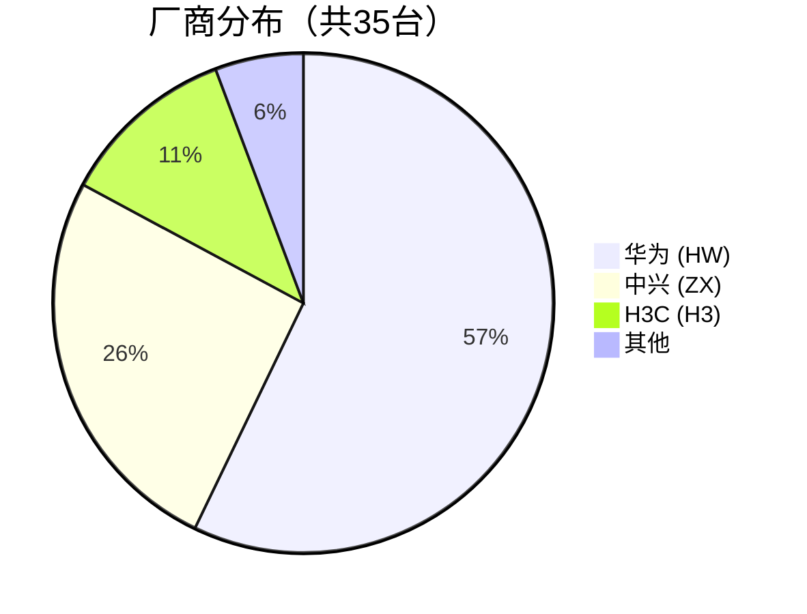
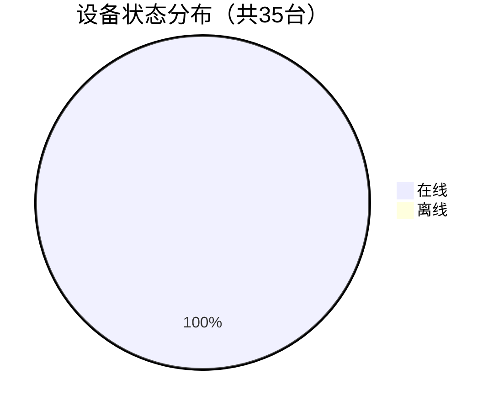
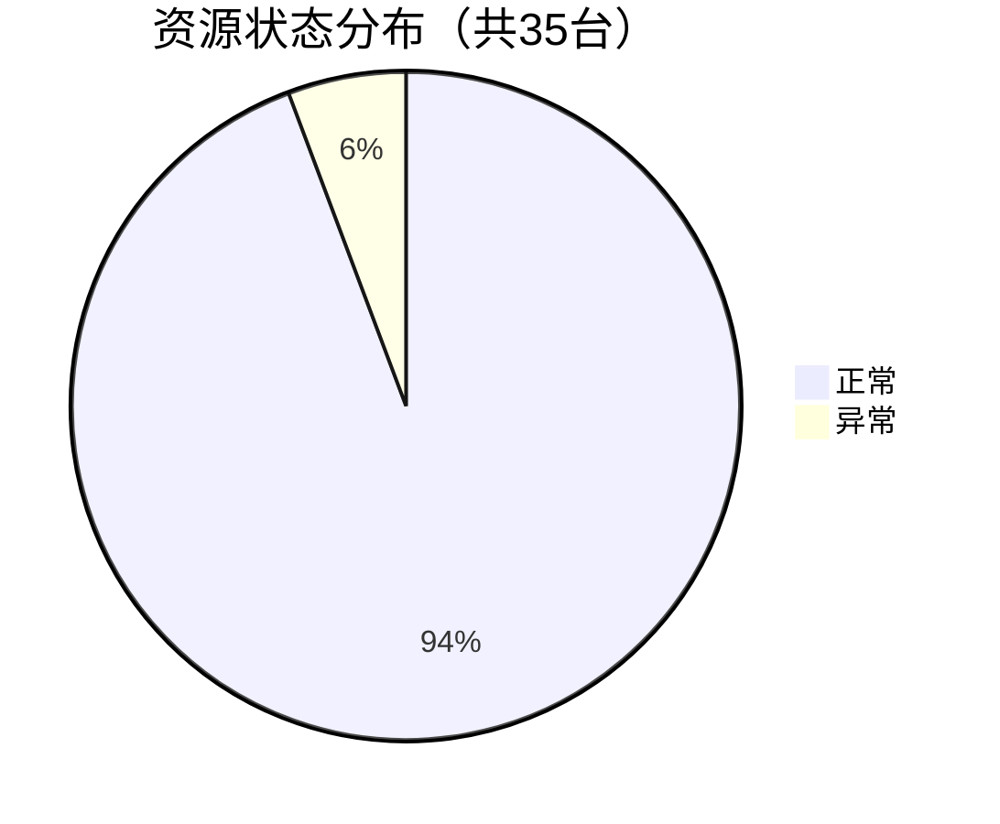
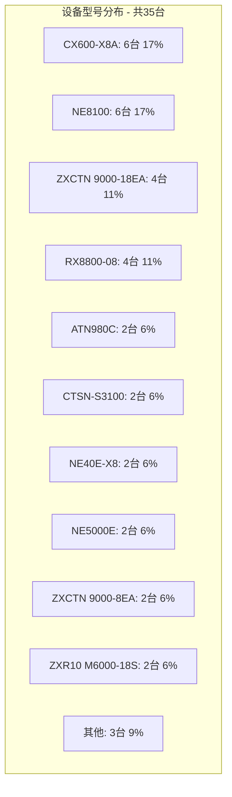
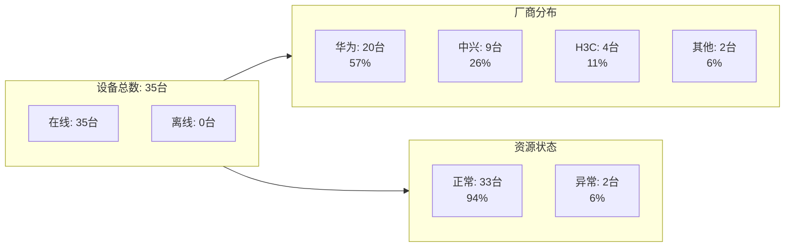
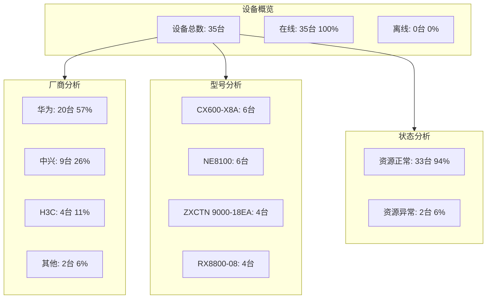

# 图表使用指南

本文档说明设备分析结果何时该用图表、该选什么图，以及输出时的统一约束。

**重要规则**：

- 所有图表只使用 ECharts 或 Mermaid
- 优先使用 ECharts
- 不要生成或保存 PNG 图片文件
- 图表要能在页面直接渲染

## 选型原则

| 场景 | 推荐图表 | 说明 |
|------|----------|------|
| 厂商分布 / 状态分布 / 类型占比 | 饼图 / 环形图 | 适合展示占比 |
| 型号 Top N / 厂商数量对比 | 柱状图 | 适合展示数量差异 |
| 单一关键指标，如在线率 | 仪表盘 | 适合单指标强调 |
| 明细清单 | Markdown 表格 | 不建议强行图表化 |
| 综合报告 | 1 个图表 + 1 个表格起步 | 避免堆太多图 |

## 推荐使用 ECharts

ECharts 更适合：

- 交互式提示
- 更复杂的布局
- 更好的观感
- 更稳定的柱状图、环形图、仪表盘

### ECharts 使用方法

使用 ```echarts 代码块包裹 JSON 配置：

```echarts
{
  "title": {
    "text": "设备厂商分布",
    "left": "center"
  },
  "tooltip": {
    "trigger": "item"
  },
  "legend": {
    "orient": "vertical",
    "left": "left"
  },
  "series": [
    {
      "name": "厂商分布",
      "type": "pie",
      "radius": "50%",
      "data": [
        { "value": 20, "name": "华为" },
        { "value": 9, "name": "中兴" },
        { "value": 4, "name": "H3C" },
        { "value": 2, "name": "其他" }
      ],
      "emphasis": {
        "itemStyle": {
          "shadowBlur": 10,
          "shadowOffsetX": 0,
          "shadowColor": "rgba(0, 0, 0, 0.5)"
        }
      }
    }
  ]
}
```

### ECharts 优势

- 图表类型更丰富
- 悬停提示更友好
- 更适合正式报告场景
- 响应式表现更好

## Mermaid 备选方案

Mermaid 适合快速、轻量的可视化，但复杂场景优先 ECharts。

## 图表类型选择

### 1. Markdown 表格
适用于：详细数据列表

**示例：设备型号统计表**

| 序号 | 设备型号 | 数量 | 厂商 | 占比 | 设备示例 |
|------|----------|------|------|------|----------|
| 1 | CX600-X8A | 6 | HW | 17% | DKCZZ-HUAWEI-DCLEAF-1, DKCZZ-HUAWEI-DCLEAF-2... |
| 2 | NE8100 | 6 | HW | 17% | DKCZZ-HUAWEI-SPINE-1, DKCZZ-HUAWEI-SPINE-2... |
| 3 | ZXCTN 9000-18EA | 4 | ZX | 11% | DKCZZ-ZTE-SSPINE-1, DKCZZ-ZTE-SSPINE-2... |
| 4 | RX8800-08 | 4 | H3 | 11% | DKCZZ-H3C-SPINE-1, DKCZZ-H3C-SPINE-2... |
| 5 | ATN980C | 2 | HW | 6% | BJ-BJ-WLKJC-A-1, BJ-BJ-WLKJC-A-2... |
| ... | ... | ... | ... | ... | ... |

### 2. Mermaid 饼图

适用于：厂商分布、状态分布、类型分布

**示例：厂商分布**



**示例：设备状态分布**



**示例：资源状态分布**



### 3. Mermaid 条形图

适用于：设备型号分布、设备类型分布

**示例：设备型号分布**



### 4. Mermaid 仪表盘

适用于：关键指标展示、在线率等

**示例：设备在线率**

```mermaid
gauge
    title 设备在线率
    "在线" : 100
```

### 5. Mermaid 混合图表

适用于：综合分析报告

**示例：设备综合分析**



### 6. 综合报告模板

适用于：完整的多维度分析



## 图表使用建议

### 展示顺序

1. 先给一句结论
2. 再放 1 个最关键图表
3. 再放详细表格
4. 最后补观察点

### 设计原则

- 保持简洁，不要一口气输出过多图表
- 标题里尽量带总数或时间点
- 占比场景优先饼图 / 环形图
- 对比场景优先柱状图
- 明细场景优先表格

### 什么时候不要画图

- 只有 1~2 条记录时
- 用户只要一个简单数字时
- 数据不完整时
- 用户明确只要列表时